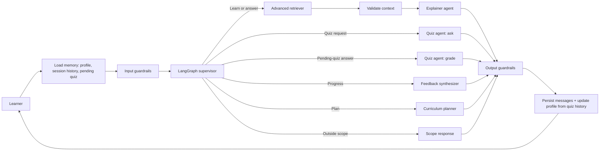

# PyMentor: Personalized Python Tutor

CSAI 422 capstone project, Option B. PyMentor is a curriculum-aware Python tutor that
uses LangGraph, advanced retrieval, persistent learner memory, pedagogical guardrails,
and a reproducible evaluation suite.

**Team**

| Student ID | Name |
|---|---|
| 202301506 | Seif Mohamed |
| 202301486 | Patrick Saweris |

## Rubric coverage

- **Advanced RAG:** baseline lexical retrieval versus metadata-aware BM25-style hybrid
  retrieval with deterministic reranking, source tracing, and a dedicated context
  validation node that gates the explainer on retrieval confidence.
- **Multi-agent LangGraph:** supervisor, retriever, context validator, explainer, quiz
  agent (asks and grades), curriculum planner, feedback synthesizer, and guardrail nodes.
- **Memory:** full session history, persisted student profile, quiz history, structured
  misconception log, and pending-quiz state, all in SQLite. Memory is both written and
  read back by the graph (see "Adaptive memory loop" below).
- **Guardrails:** prompt-injection defense, answer withholding, curriculum scope control,
  confidence calibration via the validate_context node, secret redaction, and
  prompt-leakage protection.
- **Evaluation:** 32 synthetic conversations, three learner personas, retrieval precision
  and recall, routing accuracy, pedagogical compliance, grounding rate, P95 latency, an
  optional LLM judge, and optional RAGAS evaluation.

## Architecture



The graph state explicitly carries the learner message, intent, topic, profile, recent
session history, retrieved chunks, confidence, `context_sufficient`, pending-quiz fields,
guardrail flags, and final response. Routing is inspectable and bounded; the model does
not control arbitrary code execution. "Quiz agent: ask" and "Quiz agent: grade" are two
code paths inside the single `quiz_agent` node, selected by the supervisor's `intent`
(`quiz` vs `quiz_answer`) — not separate graph nodes, to keep the architecture simple.

### Adaptive memory loop

This is the integration that makes the memory tables in `memory.py` actually affect
tutoring, not just store data:

1. **Quiz feedback loop.** When the supervisor detects the learner is replying to a
   pending quiz question (tracked via the `quiz_state` table, expiring after 1 hour),
   the quiz agent grades the reply (LLM-judge with a deterministic fallback), then calls
   `record_quiz(topic, score, details)` and, if the answer was wrong,
   `record_misconception(topic, misconception)`.
2. **Profile adaptation.** Immediately after recording a quiz attempt,
   `update_profile_from_quiz_history` recomputes `mastered_topics` and
   `struggling_topics` with a fixed, explainable rule: per-topic average score >= 0.7 is
   mastered, < 0.4 is struggling. Three mastered topics promote a beginner to
   intermediate; six promote intermediate to advanced. No LLM is involved in this
   decision.
3. **Memory-driven explanations.** When the explainer is about to teach a topic, it
   checks the profile's misconception log for entries on that same topic. If one exists,
   it tells the model (or, in the deterministic fallback, prepends directly) something
   like "Previously you had difficulty with X. Let's review that first."
4. **Context validation.** `validate_context` is a small, single-purpose node between
   `retrieve` and `explainer` that turns the retrieval confidence score into a boolean
   `context_sufficient`. If false, the explainer refuses to answer rather than
   hallucinating, and instead asks the learner to pick a topic from the indexed syllabus.

## Setup

Python 3.9 or newer is required. Ollama and `qwen3:4b` are already installed on the
development machine.

```bash
python3 -m venv .venv
source .venv/bin/activate
pip install -e ".[demo,eval,test]"
cp .env.example .env
```

Choose one provider in `.env`:

```bash
# Local and private
LLM_PROVIDER=ollama
OLLAMA_MODEL=qwen3:4b

# Hosted and stronger
LLM_PROVIDER=groq
GROQ_API_KEY=your_new_key_here
GROQ_MODEL=llama-3.3-70b-versatile
```

Never commit `.env`. A Groq key previously embedded in a course notebook must be revoked
before reuse.

## Run

Confirm Ollama is available:

```bash
ollama serve
ollama list
```

Run a command-line smoke test:

```bash
python scripts/smoke_test.py
```

Run the demo:

```bash
streamlit run app.py
```

## Test and evaluate

Unit and integration tests do not call an LLM. `tests/test_graph.py` covers the adaptive
memory loop (quiz grading, misconception recording, profile adaptation, memory-driven
explanations, and context validation) end-to-end using the graph's deterministic
fallback paths, so it runs offline:

```bash
pytest -q
```

Evaluate baseline and advanced retrieval:

```bash
python evaluation/run_evaluation.py
```

Run all 32 conversations through the configured model:

```bash
python evaluation/run_evaluation.py --live
python evaluation/llm_judge.py
```

Run the controlled three-persona pre/post assessment:

```bash
python evaluation/learning_assessment.py
```

The report file at `evaluation/results/latest.json` contains the metrics and case-level
evidence. Preserve this file before submission and copy its measured values into the
written report. Do not claim placeholder metrics. Note: the 32-case suite, RAGAS, and
LLM-judge scripts were not changed in this upgrade and should be re-run against the
updated graph before citing fresh numbers, since routing now includes the
`quiz_answer` intent and the `validate_context` node.

## Repository map

```text
src/python_tutor/     LangGraph, agents, retrieval, memory, providers, guardrails
data/knowledge/       Indexed CSAI 106 Python learning material
evaluation/           32 test cases, metrics, and LLM-as-judge
tests/                Deterministic unit tests
docs/                 Report, disclosure, oral-exam preparation
app.py                Streamlit live demo
```

## Design decisions

1. **Python subject:** supports objective quizzes, executable examples, misconception
   detection, and measurable pre/post learning.
2. **Direct provider adapter:** keeps Groq and Ollama interchangeable without coupling
   graph logic to one SDK.
3. **Hybrid retrieval:** term weighting, metadata boosts, title coverage, and reranking
   are transparent enough to explain during the oral exam. The retriever itself is
   unchanged from the prior iteration; only how its confidence score is consumed
   (via the new `validate_context` node) was reorganized.
4. **SQLite memory:** persistent, inspectable, easy to demo, and sufficient for the
   capstone scale. The `quiz_state` table adds pending-quiz tracking with a 1-hour
   expiry, using the same lightweight approach.
5. **Hint-first enforcement:** deterministic detection happens before model generation,
   so the policy does not depend only on prompt compliance.
6. **Deterministic profile adaptation:** mastered/struggling topics and ability level are
   computed with fixed thresholds over quiz history, not an LLM judgment call, so the
   personalization logic is fully explainable and testable without the model.
7. **No new agents for grading:** quiz creation and quiz grading are two code paths
   inside the existing quiz agent, selected by intent, rather than separate graph nodes —
   keeping the multi-agent design easy to present.

## Known limitations

- The current corpus is intentionally compact and should be expanded with instructor
  materials or official Python documentation before final evaluation.
- The advanced retriever is lexical-hybrid rather than embedding-based, making it easy to
  run offline but weaker on paraphrases.
- Final scores depend on the configured model and must be generated on the submission
  machine.
- **Quiz-answer detection is heuristic.** The supervisor decides whether a message is an
  attempt to answer a pending quiz (vs. a new question) using simple lexical cues
  (e.g. messages starting with "what is", "explain", "why" are treated as new
  questions). This works for the evaluated personas but could misclassify unusual
  phrasing.
- **Pending quiz state is per session and expires after 1 hour.** A learner who leaves a
  quiz unanswered and returns later than that will simply start a new turn instead of
  being graded on the old question.
- **Fallback quiz grading is conservative-but-imprecise.** When the LLM grader is
  unavailable, `_heuristic_grade` treats any substantive reply as correct (to avoid
  unfairly penalizing students) and only flags very short/"idk"-style replies as
  incorrect. Misconception detection is therefore weaker without a live LLM.
- **Ability-promotion thresholds (3 mastered topics -> intermediate, 6 -> advanced) are
  simple fixed constants**, not empirically tuned, and should be called out as such if
  asked during the oral exam.
