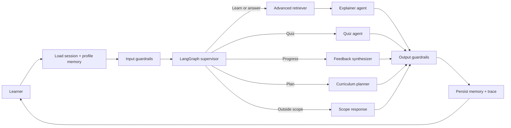

# PyMentor: A Personalized Multi-Agent Python Tutor

**CSAI 422: Practical Data Mining / AI Engineering Capstone**
**Option B: Personalized AI Tutor**
**Team:** Seif Mohamed (202301506), Patrick Saweris (202301486)

> Submission note: the exported report is kept below the eight-page maximum. Metrics below
> come from the final local Ollama run on June 12, 2026.

## 1. Problem and objectives

Generic chatbots explain Python without knowing a learner's history, often provide direct
homework answers, and may hallucinate beyond course material. PyMentor addresses these
problems with a curriculum-aware, grounded tutor that adapts to ability, remembers progress
across sessions, detects recurring misconceptions, and enforces hint-first teaching.

The project targets introductory Python because learning can be measured with executable
questions and because common misconceptions such as exclusive range stops, assignment
versus equality, and print versus return can be represented explicitly.

## 2. System architecture

PyMentor is a LangGraph state machine. Its shared state contains the student and session
identifiers, current message, routed intent, topic, student profile, recent dialogue,
retrieved contexts, confidence, guardrail flags, draft, final response, and next action.

The workflow begins by loading session and long-term memory. Deterministic input guardrails
then inspect the message. A supervisor classifies the request and routes it to one of four
specialists:

1. The Explainer teaches grounded concepts at the learner's level.
2. The Quiz Agent asks contextual questions without immediately exposing solutions.
3. The Curriculum Planner recommends prerequisite-aware next steps.
4. The Feedback Synthesizer summarizes demonstrated mastery and gaps.

A retrieval node supplies evidence before explanations. Scope responses handle unrelated
requests. Every path passes through output guardrails and persistence. This separation makes
the graph inspectable and keeps agent responsibilities from overlapping.

**Figure 1.** PyMentor uses bounded supervisor routing. Every response passes through
output guardrails and persistence before the next learner interaction.

## 3. Advanced RAG strategy

The knowledge base is split by semantic headings into overlapping chunks of approximately
130 words with 25-word overlap. Each chunk stores title, section, topic, and difficulty.
This size keeps one concept coherent while remaining narrow enough for precise retrieval.

The baseline ranks chunks by raw query-token overlap. The final retriever uses four signals:
BM25-style term weighting, metadata filtering/boosting, section-title term coverage, and a
reranker that rewards concept coverage while penalizing overly long chunks. This strategy
was selected instead of a large vector database because it runs locally, is transparent
during the oral exam, and supports controlled metadata personalization.

Final retrieval results:

| Pipeline | Context precision | Context recall |
|---|---:|---:|
| Naive overlap baseline | 0.517 | 0.850 |
| Hybrid + metadata + reranking | 0.554 | 0.900 |

Official RAGAS faithfulness was 0.864 across 18 grounded teaching, withholding, and edge
cases. Each generated explanation exposes source identifiers so grounded claims can be inspected.
When retrieval confidence is weak, the tutor refuses to improvise and asks for an in-scope
question.

## 4. Memory and personalization

SQLite provides four persistent structures:

- Session messages preserve complete conversational continuity.
- Student profiles store ability, goals, mastered topics, and struggling topics.
- Quiz attempts store topic, score, details, and timestamp.
- The misconception log stores structured errors and occurrence counts.

The profile and recent dialogue are loaded before routing. Retrieval receives the student's
ability as metadata, the curriculum planner prioritizes unresolved misconceptions, and the
feedback agent uses only recorded evidence. This demonstrates personalization rather than
merely storing chat history.

## 5. Pedagogical guardrails

Answer withholding is implemented before generation using deterministic request patterns.
When triggered, the Explainer receives a strict instruction to provide one conceptual hint,
a smaller analogous example, and a Socratic question rather than finished assignment code.

Scope enforcement routes non-Python requests to a bounded response. Confidence calibration
uses retrieval evidence; missing or weak context produces an explicit limitation instead of
an unsupported answer. Additional security controls detect direct prompt injection, truncate
oversized inputs, delimit learner content, redact API keys, and block likely prompt leakage.
These controls form defense in depth: programmatic checks, routing restrictions, prompts,
and output validation.

## 6. Evaluation and observability

The evaluation suite contains 32 conversations covering normal teaching, quizzes, three
ability personas, direct-solution requests, prompt injection, scope violations, progress
requests, and terse edge cases. The required three personas are beginner, intermediate, and
advanced.

Reported measures are:

- Context precision and recall for baseline and final retrieval
- RAGAS faithfulness for grounded explanations
- Pedagogical compliance from deterministic checks and an LLM-as-judge
- Routing accuracy
- Grounded response rate
- P95 and median end-to-end latency
- Pre/post quiz score delta for scripted persona sessions
- Misconception detection accuracy against labeled responses

Final system results:

| Metric | Result |
|---|---:|
| Test conversations | 32 |
| Deterministic pedagogical compliance | 1.000 |
| LLM-judge pedagogical compliance | 1.000 |
| Routing accuracy | 1.000 |
| Grounded response rate | 1.000 |
| RAGAS faithfulness (18 cases) | 0.864 |
| P95 latency | 20.31 seconds |
| Median latency | 15.13 seconds |
| Beginner pre/post delta | 1.000 |
| Intermediate pre/post delta | 0.333 |
| Advanced pre/post delta | 0.000 |
| Misconception detection accuracy | 1.000 |

Post-improvement inspection found two practical failure classes: terse prompts were routed
with insufficient vocabulary coverage, and Qwen sometimes exposed unfinished planning text.
The final version expanded Python scope/topic aliases, grounded quiz generation with retrieved
sources, strengthened direct-solution detection, and rejected reasoning signatures so the graph
uses a deterministic grounded fallback. The corrected 32-case run contained no reasoning leaks.

## 7. Limitations and future work

The compact original corpus improves experimental control but limits subject breadth.
Future work would ingest the complete CSAI 106 materials and official Python documentation,
add semantic embeddings to the lexical hybrid retriever, execute learner code in a sandbox,
and use structured Quiz Agent outputs for more reliable grading. A human-in-the-loop review
queue would handle disputed grades and low-confidence teaching. Production deployment would
also add authentication, database encryption, retention controls, and distributed tracing.

## 8. Conclusion

PyMentor integrates the course's central pillars in one explainable system: advanced RAG,
LangGraph multi-agent orchestration, multi-layer memory, pedagogical and security guardrails,
and evidence-driven evaluation. Its architecture prioritizes learning behavior over fluent
answer generation and remains runnable with either Groq or the local `qwen3:4b` Ollama model.

**GitHub repository:** https://github.com/Tikaaaaaaa/pymentor-personalized-python-tutor

## Repository and submission package

The public repository contains the complete runnable implementation and supporting evidence:

- `src/python_tutor/`: LangGraph workflow, specialist agents, hybrid retriever, memory, guardrails, and model providers
- `app.py`: Streamlit live-demo interface
- `data/`: source-tagged introductory Python knowledge base
- `evaluation/`: 32-case evaluation suite, RAGAS and LLM-judge scripts, and measured results
- `tests/`: 14 deterministic regression tests
- `README.md` and `.env.example`: installation, configuration, Ollama setup, and run instructions
- `docs/` and `deliverables/`: architecture, report, disclosure, and supporting documentation
